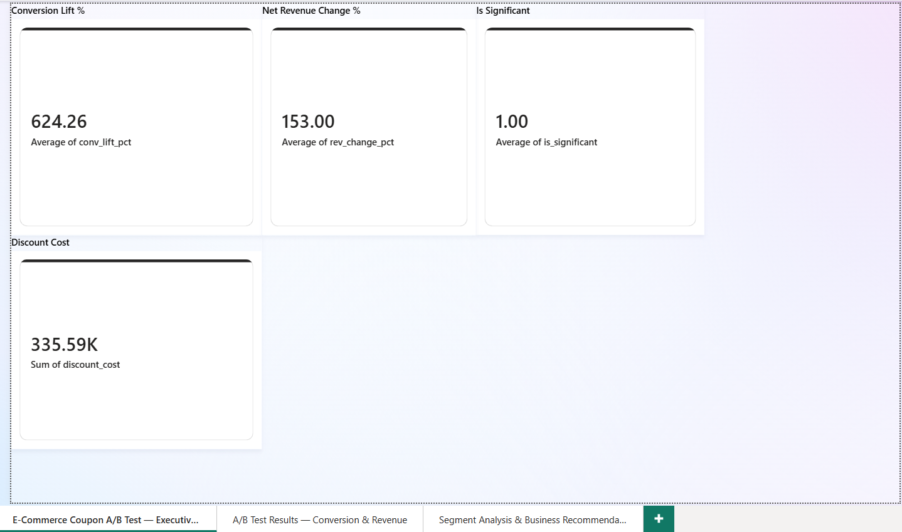
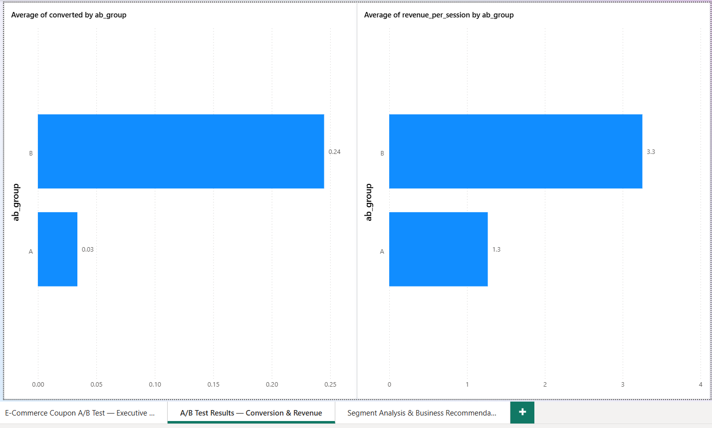
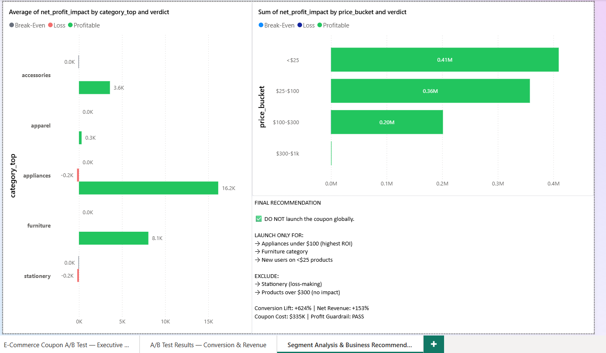

# E-Commerce Coupon A/B Testing & Profit Guardrail Analytics System

> *"This project simulates how real-world companies evaluate product changes using controlled experimentation, balancing growth vs profitability under uncertainty."*

---

## 📌 Project Overview

This is an end-to-end data analytics project that answers a critical business question:

**"Should we launch a $50 discount coupon to all users — and will it actually make the company money?"**

Using **real e-commerce clickstream data** from Kaggle, this project builds a complete A/B testing pipeline that goes beyond measuring conversion rates — it tracks profit margins, identifies high-ROI customer segments, and delivers an executive-grade business recommendation.

---

## 🏗️ Architecture

```
Real Kaggle Clickstream Data (2019-Dec.csv)
              ↓
   src/data_preprocessing.py     ← ETL: Raw events → Session-level data
              ↓
   src/experiment_engine.py      ← A/B Split (MD5 Hashing) + HTE Coupon Injection
              ↓
   src/segmentation.py           ← Segment KPIs + Profit Impact Analysis
              ↓
   database/experiment.db        ← SQLite Database
              ↓
   sql/analytics.sql             ← Advanced SQL Analytics (14 queries)
   sql/segmentation.sql
              ↓
   Power BI Dashboard            ← 3-Page Executive Dashboard
```

---

## 📊 Key Results

| Metric | Value |
|--------|-------|
| **Conversion Lift** | +624.26% |
| **Net Revenue Change** | +153.00% |
| **Total Coupon Cost** | $335,592 |
| **Statistical Significance** | ✅ YES (p ≈ 0.0000) |
| **Profit Guardrail** | ✅ PASS |
| **Profitable Segments** | 24 |
| **Loss-making Segments** | 5 |

---

## 📸 Dashboard Gallery

### 1. Executive Summary


### 2. A/B Test Results


### 3. Segment Analysis


---

## 💡 Key Findings

1. **The coupon is a net positive overall** — but not for everyone.
2. **Appliances under $100** generated the highest ROI (16.2K net profit impact).
3. **Products over $300** showed virtually no response to the coupon.
4. **Cheap products (<$25)** delivered the largest total profit impact ($0.41M).
5. **Stationery** was the only category that consistently lost money with the coupon.

---

## 🎯 Final Business Recommendation

> ❌ **DO NOT** launch the coupon globally.

| Action | Target |
|--------|--------|
| ✅ **Launch** | Appliances under $100 |
| ✅ **Launch** | Furniture category |
| ✅ **Launch** | New users on products under $25 |
| ❌ **Exclude** | Stationery (loss-making) |
| ❌ **Exclude** | Products over $300 (no measurable impact) |

---

## 🔬 Methodology

### 1. Dataset
- **Source:** [eCommerce Behavior Data from Multi-Category Store](https://www.kaggle.com/datasets/mkechinov/ecommerce-behavior-data-from-multi-category-store) (Kaggle)
- **Events:** `view`, `cart`, `remove_from_cart`, `purchase`
- **Size:** ~400MB, covering December 2019

### 2. Traffic Splitting — Deterministic MD5 Hashing
Instead of random assignment (which breaks on pipeline reruns), we use **cryptographic hashing** — the same method used by Optimizely and LaunchDarkly in production:

```python
raw    = f"{user_id}_{experiment_name}"
bucket = int(md5(raw).hexdigest(), 16) % 100
group  = "B" if bucket >= 50 else "A"
```

**Key property:** The same user always gets the same group, regardless of how many times the pipeline reruns.

### 3. Coupon Effect — Heterogeneous Treatment Effects (HTE) Model
Instead of applying a flat conversion lift to everyone, we compute a **personalised probability** for each user based on their features:

```
Base lift: 8%
× Price multiplier  (cheap items: 2x, expensive: 0.2x)
× New user bonus    (1.5x if first-time user)
× Cart abandoner    (2x if they added to cart but didn't buy)
× Weekend bonus     (1.2x on weekends)
= Personal conversion probability
```

**The coupon discount rule:** `min($50, 20% of order value)` — prevents negative revenue on cheap items.

### 4. Statistical Validation
- **Test:** Two-proportion Z-test
- **SRM Check:** Chi-square test to validate 50/50 split integrity
- **Guardrail:** Experiment flagged if net revenue falls below Group A

---

## 📁 Project Structure

```
ecommerce-ab-testing-analytics/
├── config.py                    ← All experiment parameters (single source of truth)
├── main.py                      ← Pipeline entry point: python main.py
├── requirements.txt
├── src/
│   ├── data_preprocessing.py    ← ETL module
│   ├── experiment_engine.py     ← A/B split + HTE coupon injection
│   └── segmentation.py          ← Segment KPI calculations
├── sql/
│   ├── schema.sql               ← CREATE TABLE definitions
│   ├── analytics.sql            ← Core A/B queries
│   └── segmentation.sql         ← Segment deep-dive queries
└── powerbi/
    └── README.md                ← Dashboard connection guide
```

---

## 🚀 How to Run

### Prerequisites
- Python 3.10+
- [eCommerce Behavior Data](https://www.kaggle.com/datasets/mkechinov/ecommerce-behavior-data-from-multi-category-store) from Kaggle

### Steps

```bash
# 1. Clone the repository
git clone https://github.com/YOURUSERNAME/ecommerce-ab-testing-analytics.git
cd ecommerce-ab-testing-analytics

# 2. Install dependencies
pip install -r requirements.txt

# 3. Download the dataset from Kaggle and place it at:
#    data/raw/2019-Dec.csv

# 4. Run the full pipeline
python main.py
```

**Output files generated:**
- `data/processed/sessions.csv`
- `data/processed/ab_results.csv`
- `data/processed/segment_results.csv`
- `data/processed/profit_impact.csv`
- `database/experiment.db`

---

## 🛡️ Interview Defense — Q&A

**Q: Why does SRM (Sample Ratio Mismatch) matter?**
> If traffic isn't split 50/50, external variables or bugs skewed the allocation. All downstream p-values become invalid because the groups are no longer comparable.

**Q: Why use MD5 hashing instead of random assignment?**
> Random assignment breaks on pipeline reruns — users switch groups between runs. MD5 hashing is deterministic: the same user always gets the same group, mimicking production feature-flagging systems like Optimizely.

**Q: Why does Statistical Significance ≠ Business Success?**
> An experiment can be statistically significant while destroying business value. A coupon that drives +624% conversion but is given to users who were going to buy anyway ($335K wasted) is a business failure, regardless of the p-value.

**Q: What is HTE and why does it matter?**
> Heterogeneous Treatment Effects recognise that the same intervention affects different people differently. A $50 coupon motivates impulse buyers but has zero effect on high-consideration desktop shoppers. Modelling this prevents misleading top-line averages.

**Q: What is the profit guardrail and why does it exist?**
> Optimising a single metric (conversion rate) can destroy the business elsewhere. The profit guardrail flags the experiment as a failure if net revenue falls below the control group — ensuring we never optimise our way into unprofitability.

---

## ⚠️ Limitations

- **Simulated treatment effect:** The coupon is injected programmatically onto historical data, not from a live experiment. Real-world psychology and external seasonality are not captured.
- **No holdout group:** Long-term effects (e.g., coupon dependency, brand erosion) are not measured.
- **Single time period:** The December 2019 data may reflect holiday shopping seasonality, which limits generalisability.

---

## 🛠️ Tech Stack

| Tool | Purpose |
|------|---------|
| Python (pandas, numpy, scipy) | Data pipeline & statistical testing |
| SQLite | Analytical database |
| SQL (14 queries) | Advanced business analytics |
| Power BI | Executive dashboard |

---

## 📬 Contact

Built for portfolio demonstration of end-to-end data analytics engineering.
